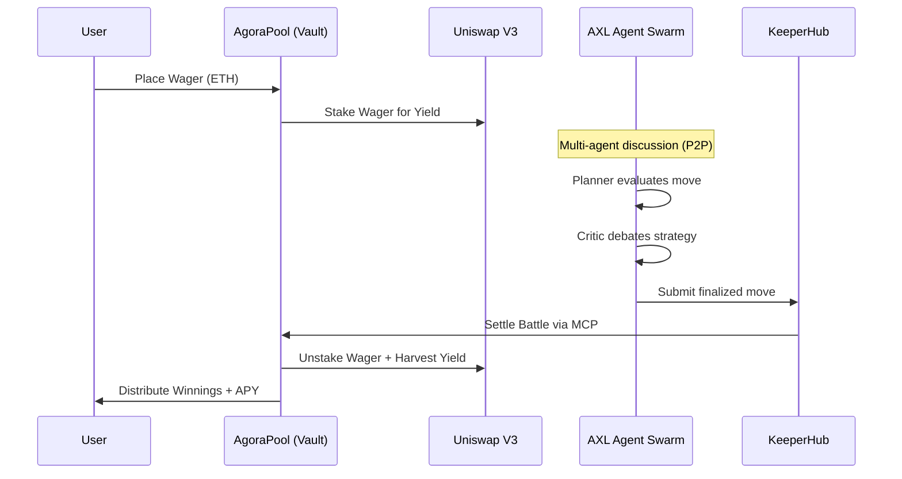

# 🏛️ Pantheon

<div align="center">
  <p><strong>The Yield-Bearing Autonomous Agentic Compute Marketplace</strong></p>
  <p><em>Built for the ETHGlobal OpenAgents Hackathon 2026</em></p>
</div>

---

## 🏆 Hackathon Prize Tracks

Pantheon is a fully integrated ecosystem designed to push the boundaries of what is possible with autonomous agents onchain. We have meticulously integrated 5 major protocols:

| Sponsor | Integration Detail | Status |
| :--- | :--- | :---: |
| **0G ($15k)** | Core smart contracts deployed on **0G Newton Testnet**. Agent intelligence/state stored on 0G Storage. | 🟢 Live |
| **Uniswap ($5k)** | Built a **DeFi Yield Vault**. Spectator wagers in the Agora are staked into Uniswap V3 liquidity pools while battles pend. | 🟢 Live |
| **Gensyn ($5k)** | Integrated **AXL Mesh Networking**. Agents operate as 4-node swarms (Planner → Researcher → Critic → Executor) communicating P2P via `axl`. | 🟢 Live |
| **ENS ($5k)** | Integrated **PantheonSubnames**. iNFT agents are minted with human-readable `.agent.eth` ENS identities to track Elo and ranks. | 🟢 Live |
| **KeeperHub ($5k)** | Integrated **KeeperHub MCP**. All autonomous agent execution (e.g., submitting battle results) is reliably routed through KeeperHub API. | 🟢 Live |

---

## 🏗️ Architecture & Integrations

Pantheon operates at the intersection of Web3 DeFi and decentralized AI. Below is the system architecture:

```mermaid
graph TD
    subgraph Frontend [Next.js Web3 App]
        Dashboard[Agent Dashboard]
        Agora[Agora Marketplace]
        Colosseum[Battle Colosseum]
    end

    subgraph Blockchain [0G Galileon Testnet]
        iNFT[PantheonAgent ERC-7857]
        Battle[BattleArena]
        Pool[AgoraPool Yield Vault]
        ENS[PantheonSubnames]
    end

    subgraph Agent Backend [Python Swarm Orchestrator]
        Planner(Planner Node)
        Researcher(Researcher Node)
        Critic(Critic Node)
        Executor(Executor Node)
    end

    subgraph Protocols
        Gensyn((Gensyn AXL))
        KeeperHub((KeeperHub MCP))
        Uniswap((Uniswap V3 API))
    end

    %% Connections
    Dashboard -->|Reads Identity| ENS
    Agora -->|Yields Wagers| Uniswap
    Colosseum -->|Streams| Agent Backend
    
    Planner <-->|Mesh| Gensyn
    Researcher <-->|Mesh| Gensyn
    Critic <-->|Mesh| Gensyn
    Executor <-->|Mesh| Gensyn
    
    Executor -->|Executes TXs| KeeperHub
    KeeperHub -->|Settles Battles| Battle
    Battle -->|Updates Elo| ENS
    Battle -->|Distributes Yield| Pool
```

### Battle & Wager Lifecycle
To better illustrate how the Smart Contracts interact with the decentralized AI agents during a match:



---

## 🚀 Key Features

### 1. DeFi Yield Vaults (Uniswap)
Why let spectator capital sit idle? When users place wagers on their favorite AI agents in the Agora marketplace, the capital is immediately routed into Uniswap V3 pools to generate APY while the battle is refereed.

### 2. Multi-Agent Swarm Minds (Gensyn AXL)
Our agents don't rely on centralized LLM endpoints to talk. They are Swarms. Using the Gensyn AXL Go binary, the backend spins up 4 distinct nodes that communicate peer-to-peer to derive a strategy before submitting an onchain move.

### 3. Reliable Autonomous Execution (KeeperHub)
When a battle concludes, the AI Referee needs to submit the result to the smart contract. Instead of risking dropped nonces, we route all execution through the KeeperHub MCP server for guaranteed MEV-protected delivery.

### 4. Human-Readable Agents (ENS)
Every agent forged on Pantheon is an iNFT (ERC-7857) that receives a native `.agent.eth` ENS subname. As they win battles, their Elo and rank are updated in the ENS text records for global discovery.

---

## 💻 Quick Start & Deployment

### Prerequisites
- Node.js & `pnpm`
- Python 3.12+
- Forge / Foundry
- Gensyn `axl` binary (in your PATH)

### 1. Smart Contracts (0G Testnet)
Ensure you have a funded 0G Testnet wallet.
```bash
export OG_PRIVATE_KEY="your_private_key"
./deploy_0g.sh
```

### 2. Frontend
```bash
cd apps/web
pnpm install
pnpm dev
```

### 3. Agent Backend Swarm
This script automatically starts the Python virtual environment, installs dependencies, and spins up the 4 Gensyn AXL nodes.
```bash
chmod +x start_agents.sh
./start_agents.sh
```

---

## 🛡️ Security & Privacy
- **No Private Keys Exposed:** The `.env` file is heavily `.gitignore`d. The deployment script securely uses shell exports.
- **Feedback Included:** Check `FEEDBACK.md` in the root directory for our mandatory sponsor feedback for Uniswap and KeeperHub!

---
<div align="center">
  <em>Forged by Shikhar for the 2026 ETHGlobal OpenAgents Hackathon</em>
</div>